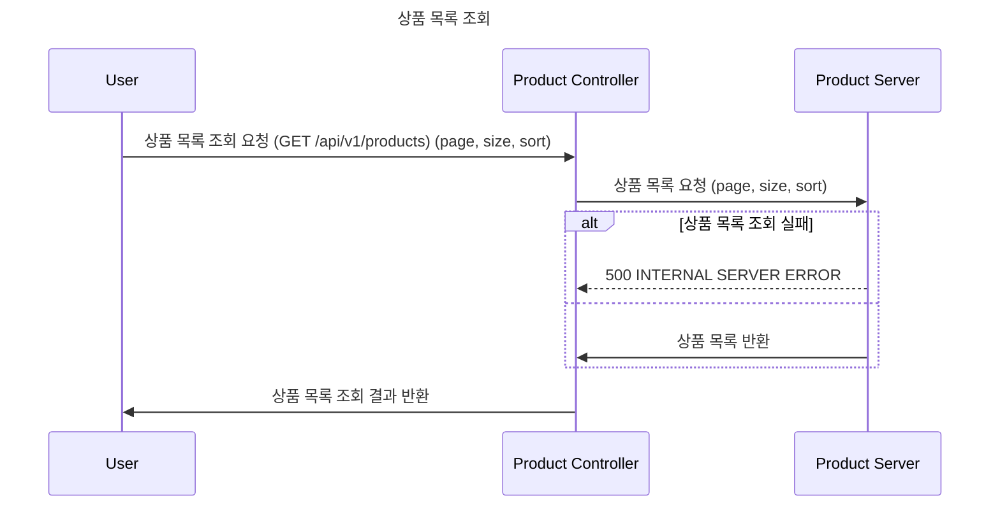
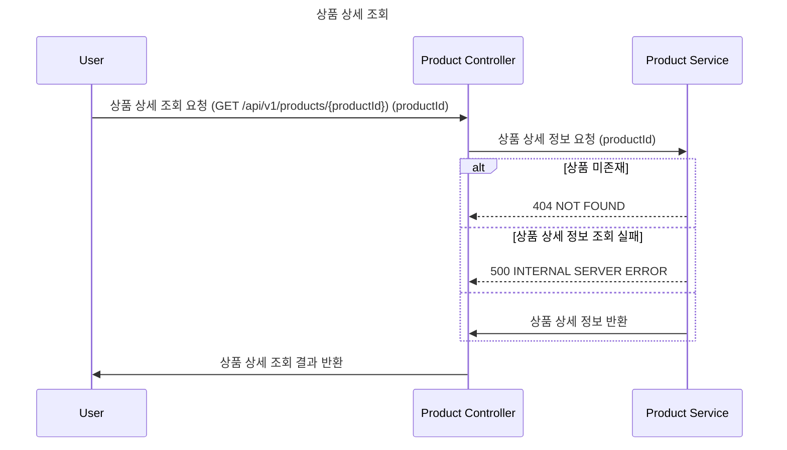
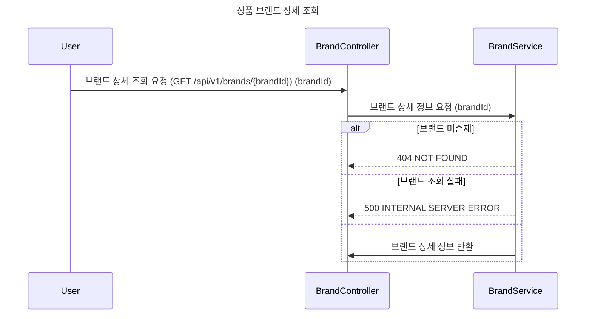
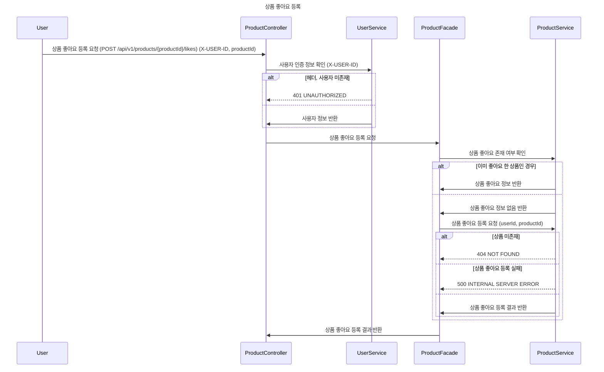
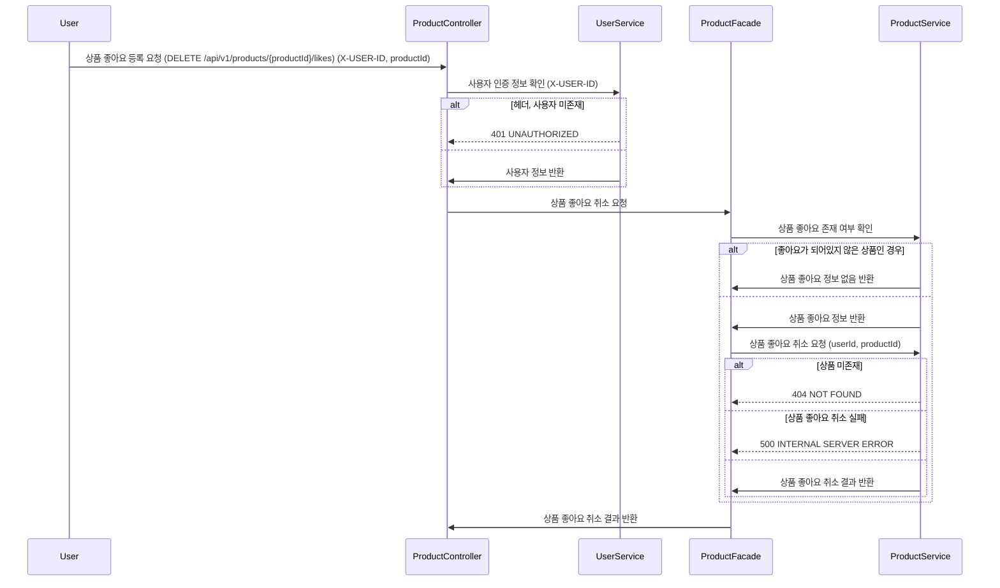
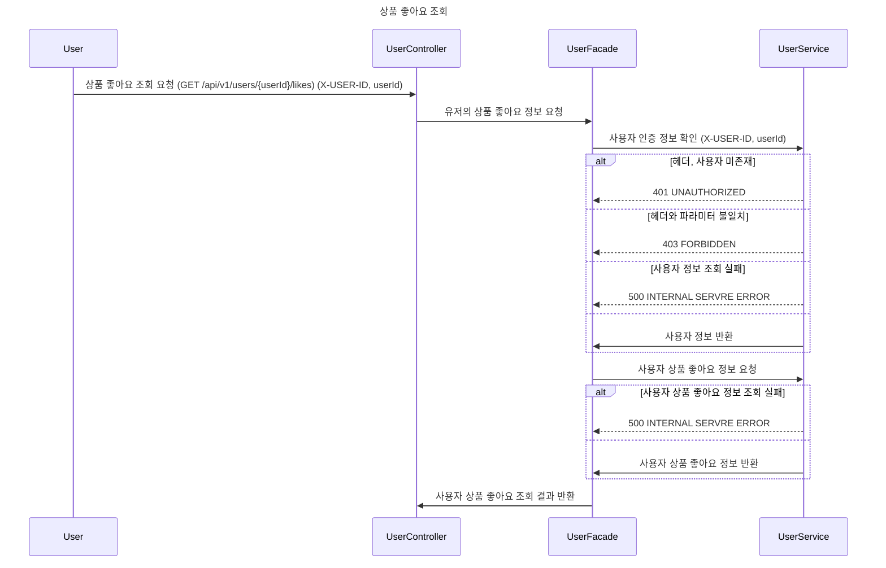
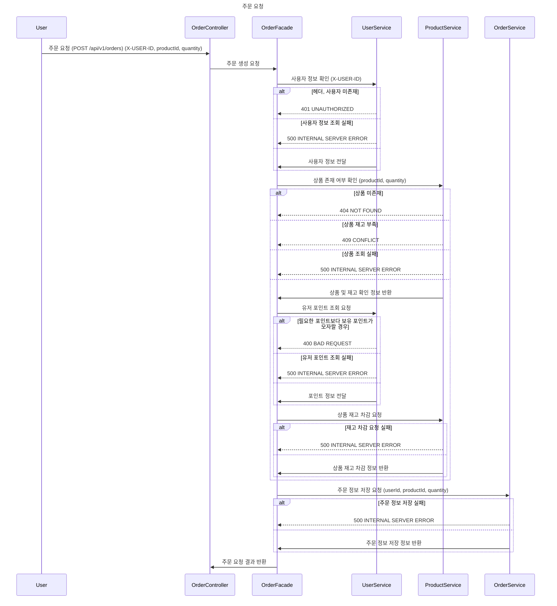
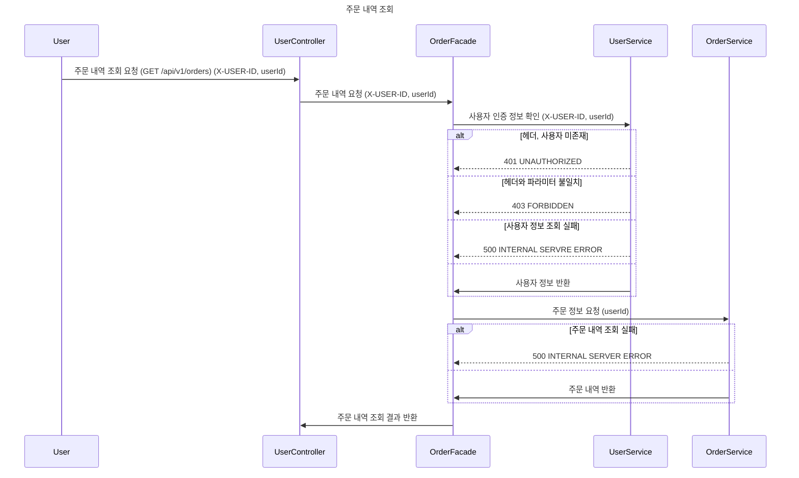
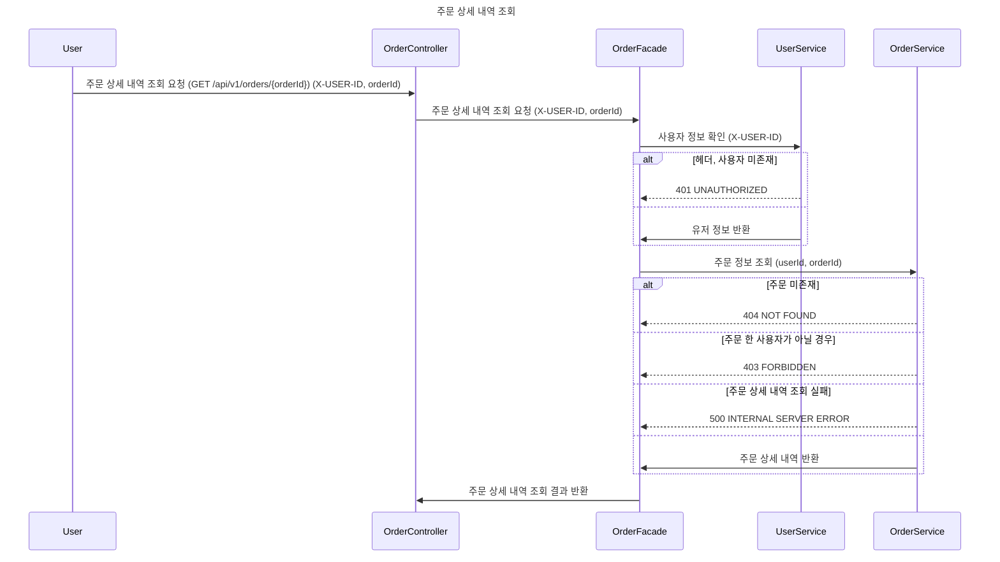

```mermaid
---
title: 상품 목록 조회
---

sequenceDiagram
    participant u as User
    participant pc as Product Controller
    participant ps as Product Server
    u ->> pc: 상품 목록 조회 요청 (GET /api/v1/products) (page, size, sort)
    pc ->> ps: 상품 목록 요청 (page, size, sort)
    alt 상품 목록 조회 실패
        ps -->> pc: 500 INTERNAL SERVER ERROR
    else
        ps ->> pc: 상품 목록 반환
    end
    pc ->> u: 상품 목록 조회 결과 반환
```

```mermaid
---
title: 상품 상세 조회
---

sequenceDiagram
    participant u as User
    participant pc as Product Controller
    participant ps as Product Service
    u ->> pc: 상품 상세 조회 요청 (GET /api/v1/products/{productId}) (productId)
    pc ->> ps: 상품 상세 정보 요청 (productId)
    alt 상품 미존재
        ps -->> pc: 404 NOT FOUND
    else 상품 상세 정보 조회 실패
        ps -->> pc: 500 INTERNAL SERVER ERROR
    else
        ps ->> pc: 상품 상세 정보 반환
    end
    pc ->> u: 상품 상세 조회 결과 반환
```

```mermaid
---
title: 상품 브랜드 상세 조회
---

sequenceDiagram
    participant u as User
    participant bc as BrandController
    participant bs as BrandService
    u ->> bc: 브랜드 상세 조회 요청 (GET /api/v1/brands/{brandId}) (brandId)
    bc ->> bs: 브랜드 상세 정보 요청 (brandId)
    alt 브랜드 미존재
        bs -->> bc: 404 NOT FOUND
    else 브랜드 조회 실패
        bs -->> bc: 500 INTERNAL SERVER ERROR
    else
        bs ->> bc: 브랜드 상세 정보 반환
    end
```

```mermaid
---
title: 상품 좋아요 등록
---

sequenceDiagram
    participant u as User
    participant pc as ProductController
    participant us as UserService
    participant pf as ProductFacade
    participant ps as ProductService
    u ->> pc: 상품 좋아요 등록 요청 (POST /api/v1/products/{productId}/likes) (X-USER-ID, productId)
    pc ->> us: 사용자 인증 정보 확인 (X-USER-ID)
    alt 헤더, 사용자 미존재
        us -->> pc: 401 UNAUTHORIZED
    else
        us ->> pc: 사용자 정보 반환
    end
    pc ->> pf: 상품 좋아요 등록 요청
    pf ->> ps: 상품 좋아요 존재 여부 확인
    alt 이미 좋아요 한 상품인 경우
        ps ->> pf: 상품 좋아요 정보 반환
    else
        ps ->> pf: 상품 좋아요 정보 없음 반환
        pf ->> ps: 상품 좋아요 등록 요청 (userId, productId)
        alt 상품 미존재
            ps -->> pf: 404 NOT FOUND
        else 상품 좋아요 등록 실패
            ps -->> pf: 500 INTERNAL SERVER ERROR
        else
            ps ->> pf: 상품 좋아요 등록 결과 반환
        end
    end
    pf ->> pc: 상품 좋아요 등록 결과 반환
```

```mermaid
---
상품 좋아요 취소
---

sequenceDiagram
    participant u as User
    participant pc as ProductController
    participant us as UserService
    participant pf as ProductFacade
    participant ps as ProductService
    u ->> pc: 상품 좋아요 등록 요청 (DELETE /api/v1/products/{productId}/likes) (X-USER-ID, productId)
    pc ->> us: 사용자 인증 정보 확인 (X-USER-ID)
    alt 헤더, 사용자 미존재
        us -->> pc: 401 UNAUTHORIZED
    else
        us ->> pc: 사용자 정보 반환
    end
    pc ->> pf: 상품 좋아요 취소 요청
    pf ->> ps: 상품 좋아요 존재 여부 확인
    alt 좋아요가 되어있지 않은 상품인 경우
        ps ->> pf: 상품 좋아요 정보 없음 반환
    else
        ps ->> pf: 상품 좋아요 정보 반환
        pf ->> ps: 상품 좋아요 취소 요청 (userId, productId)
        alt 상품 미존재
            ps -->> pf: 404 NOT FOUND
        else 상품 좋아요 취소 실패
            ps -->> pf: 500 INTERNAL SERVER ERROR
        else
            ps ->> pf: 상품 좋아요 취소 결과 반환
        end
    end
    pf ->> pc: 상품 좋아요 취소 결과 반환
```

```mermaid
---
title: 상품 좋아요 조회
---

sequenceDiagram
    participant u as User
    participant uc as UserController
    participant uf as UserFacade
    participant us as UserService
    u ->> uc: 상품 좋아요 조회 요청 (GET /api/v1/users/{userId}/likes) (X-USER-ID, userId)
    uc ->> uf: 유저의 상품 좋아요 정보 요청
    uf ->> us: 사용자 인증 정보 확인 (X-USER-ID, userId)
    alt 헤더, 사용자 미존재
        us -->> uf: 401 UNAUTHORIZED
    else 헤더와 파라미터 불일치
        us -->> uf: 403 FORBIDDEN
    else 사용자 정보 조회 실패
        us -->> uf: 500 INTERNAL SERVRE ERROR
    else
        us ->> uf: 사용자 정보 반환
    end
    uf ->> us: 사용자 상품 좋아요 정보 요청
    alt 사용자 상품 좋아요 정보 조회 실패
        us -->> uf: 500 INTERNAL SERVRE ERROR
    else
        us ->> uf: 사용자 상품 좋아요 정보 반환
    end
    uf ->> uc: 사용자 상품 좋아요 조회 결과 반환

```

```mermaid
---
title: 주문 요청
---
%% TODO: 유저 돈 모자라면 실패하는 로직은 어디감?

sequenceDiagram
    participant u as User
    participant oc as OrderController
    participant of as OrderFacade
    participant us as UserService
    participant ps as ProductService
    participant os as OrderService
    u ->> oc: 주문 요청 (POST /api/v1/orders) (X-USER-ID, productId, quantity)
    oc ->> of: 주문 생성 요청
    of ->> us: 사용자 정보 확인 (X-USER-ID)
    alt 헤더, 사용자 미존재
        us -->> of: 401 UNAUTHORIZED
    else 사용자 정보 조회 실패
        us -->> of: 500 INTERNAL SERVER ERROR
    else
        us ->> of: 사용자 정보 전달
    end
    of ->> ps: 상품 존재 여부 확인 (productId, quantity)
    alt 상품 미존재
        ps -->> of: 404 NOT FOUND
    else 상품 재고 부족
        ps -->> of: 409 CONFLICT
    else 상품 조회 실패
        ps -->> of: 500 INTERNAL SERVER ERROR
    else
        ps ->> of: 상품 및 재고 확인 정보 반환
        of ->> us: 유저 포인트 조회 요청
        alt 필요한 포인트보다 보유 포인트가 모자랄 경우
            us -->> of: 400 BAD REQUEST
        else 유저 포인트 조회 실패
            us -->> of: 500 INTERNAL SERVER ERROR
        else
            us ->> of: 포인트 정보 전달
        end
        of ->> ps: 상품 재고 차감 요청
        alt 재고 차감 요청 실패
            ps -->> of: 500 INTERNAL SERVER ERROR
        else
            ps ->> of: 상품 재고 차감 정보 반환
        end
    end
    of ->> os: 주문 정보 저장 요청 (userId, productId, quantity)
    alt 주문 정보 저장 실패
        os -->> of: 500 INTERNAL SERVER ERROR
    else
        os ->> of: 주문 정보 저장 정보 반환
    end
    of ->> oc: 주문 요청 결과 반환
```

```mermaid
---
title: 주문 내역 조회
---

sequenceDiagram
    participant u as User
    participant uc as UserController
    participant of as OrderFacade
    participant us as UserService
    participant os as OrderService
    u ->> uc: 주문 내역 조회 요청 (GET /api/v1/orders) (X-USER-ID, userId)
    uc ->> of: 주문 내역 요청 (X-USER-ID, userId)
    of ->> us: 사용자 인증 정보 확인 (X-USER-ID, userId)
    alt 헤더, 사용자 미존재
        us -->> of: 401 UNAUTHORIZED
    else 헤더와 파라미터 불일치
        us -->> of: 403 FORBIDDEN
    else 사용자 정보 조회 실패
        us -->> of: 500 INTERNAL SERVRE ERROR
    else
        us ->> of: 사용자 정보 반환
    end
    of ->> os: 주문 정보 요청 (userId)
    alt 주문 내역 조회 실패
        os -->> of: 500 INTERNAL SERVER ERROR
    else
        os ->> of: 주문 내역 반환
    end
    of ->> uc: 주문 내역 조회 결과 반환
```

```mermaid
---
title: 주문 상세 내역 조회
---

sequenceDiagram
    participant u as User
    participant oc as OrderController
    participant of as OrderFacade
    participant us as UserService
    participant os as OrderService
    u ->> oc: 주문 상세 내역 조회 요청 (GET /api/v1/orders/{orderId}) (X-USER-ID, orderId)
    oc ->> of: 주문 상세 내역 조회 요청 (X-USER-ID, orderId)
    of ->> us: 사용자 정보 확인 (X-USER-ID)
    alt 헤더, 사용자 미존재
        us -->> of: 401 UNAUTHORIZED
    else
        us ->> of: 유저 정보 반환
    end
    of ->> os: 주문 정보 조회 (userId, orderId)
    alt 주문 미존재
        os -->> of: 404 NOT FOUND
    else 주문 한 사용자가 아닐 경우
        os -->> of: 403 FORBIDDEN
    else 주문 상세 내역 조회 실패
        os -->> of: 500 INTERNAL SERVER ERROR
    else
        os ->> of: 주문 상세 내역 반환
    end
    of ->> oc: 주문 상세 내역 조회 결과 반환
```