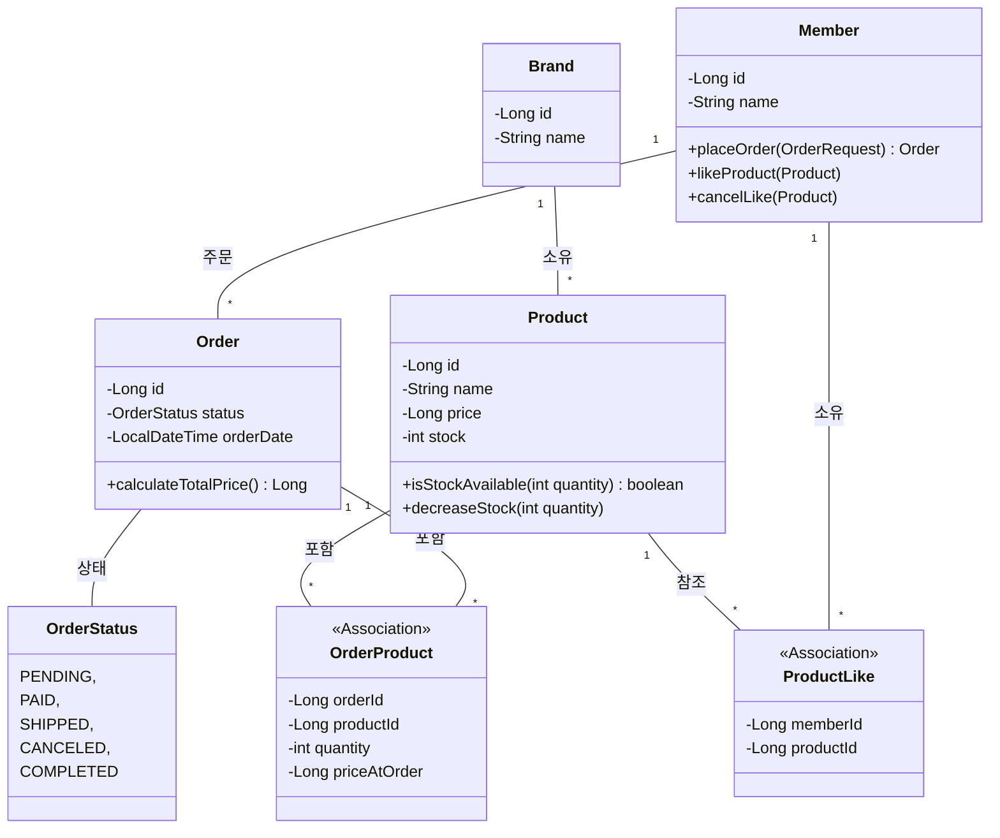
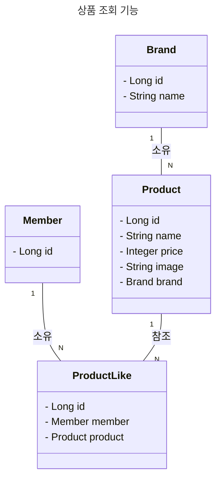
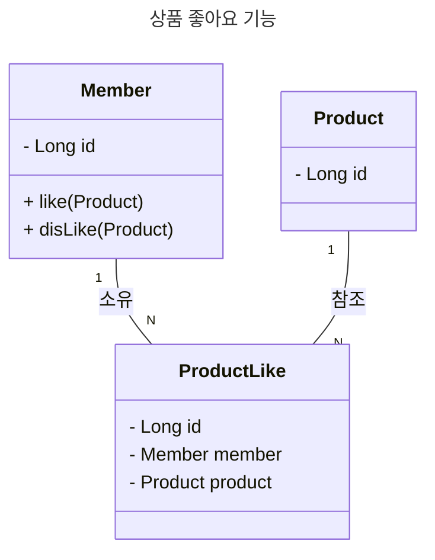
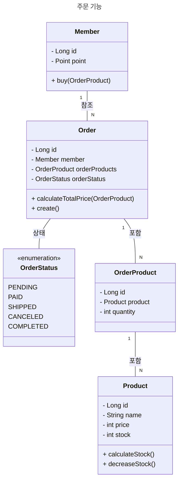

```mermaid
classDiagram
    class Member {
        -Long id
        -String name
        +placeOrder(OrderRequest) Order
        +likeProduct(Product)
        +cancelLike(Product)
    }

    class Product {
        -Long id
        -String name
        -Long price
        -int stock
        +isStockAvailable(int quantity) boolean
        +decreaseStock(int quantity)
    }

    class Brand {
        -Long id
        -String name
    }

    class Order {
        -Long id
        -OrderStatus status
        -LocalDateTime orderDate
        +calculateTotalPrice() Long
    }

    class ProductLike {
        <<Association>>
        -Long memberId
        -Long productId
    }

    class OrderProduct {
        <<Association>>
        -Long orderId
        -Long productId
        -int quantity
        -Long priceAtOrder
    }

    class OrderStatus {
        PENDING,
        PAID,
        SHIPPED,
        CANCELED,
        COMPLETED
    }

    Member "1" -- "*" Order: 주문
    Member "1" -- "*" ProductLike: 소유
    Product "1" -- "*" ProductLike: 참조
    Order "1" -- "*" OrderProduct: 포함
    Product "1" -- "*" OrderProduct: 포함
    Brand "1" -- "*" Product: 소유
    Order -- OrderStatus: 상태
```

```mermaid
---
title: 상품 조회 기능
---

classDiagram
    class Product {
        - Long id
        - String name
        - Integer price
        - String image
        - Brand brand
    }

    class Brand {
        - Long id
        - String name
    }

    class ProductLike {
        - Long id
        - Member member
        - Product product
    }

    class Member {
        - Long id
    }

    Member "1" -- "N" ProductLike: 소유
    Product "1" -- "N" ProductLike: 참조
    Brand "1" -- "N" Product: 소유
```

```mermaid
---
title: 상품 좋아요 기능
---

classDiagram
    class Product {
        - Long id
    }
    
    class Member {
        - Long id
        + like(Product) 
        + disLike(Product)
    }
    
    class ProductLike {
        - Long id
        - Member member
        - Product product
    }

    Member "1" -- "N" ProductLike: 소유
    Product "1" -- "N" ProductLike: 참조
```

```mermaid
---
title: 주문 기능
---

classDiagram
    class Product {
        - Long id
        - String name
        - int price
        - int stock
        + calculateStock()
        + decreaseStock()
    }

    class Member {
        - Long id
        - Point point
        + buy(OrderProduct)
    }

    class Order {
        - Long id
        - Member member
        - OrderProduct orderProducts
        - OrderStatus orderStatus
        + calculateTotalPrice(OrderProduct)
        + create()
    }

    class OrderStatus {
        <<enumeration>>
        PENDING
        PAID
        SHIPPED
        CANCELED
        COMPLETED
    }

    class OrderProduct {
        - Long id
        - Product product
        - int quantity
    }

    Member "1" -- "N" Order: 참조
    Order "1" -- "N" OrderProduct: 포함
    OrderProduct "1" -- "N" Product: 포함
    Order  --  OrderStatus: 상태
```