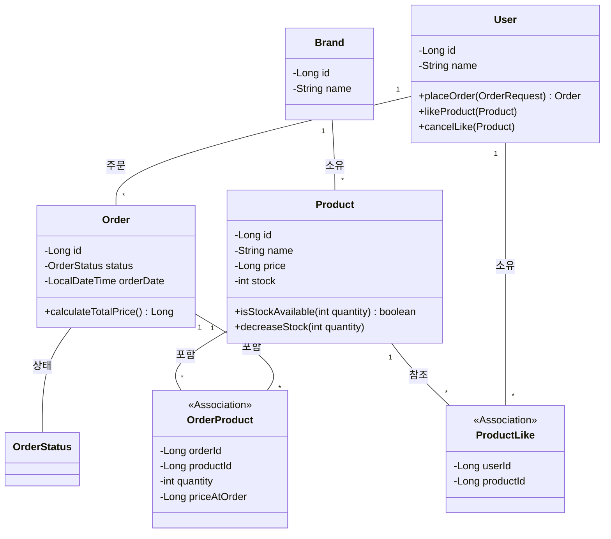

```mermaid
classDiagram
    class User {
        -Long id
        -String name
        +placeOrder(OrderRequest) Order
        +likeProduct(Product)
        +cancelLike(Product)
    }

    class Product {
        -Long id
        -String name
        -Long price
        -int stock
        +isStockAvailable(int quantity) boolean
        +decreaseStock(int quantity)
    }

    class Brand {
        -Long id
        -String name
    }

    class Order {
        -Long id
        -OrderStatus status
        -LocalDateTime orderDate
        +calculateTotalPrice() Long
    }

    class ProductLike {
        <<Association>>
        -Long userId
        -Long productId
    }

    class OrderProduct {
        <<Association>>
        -Long orderId
        -Long productId
        -int quantity
        -Long priceAtOrder
    }

%%    enum OrderStatus {
%%        PENDING,
%%        PAID,
%%        SHIPPED,
%%        CANCELED,
%%        COMPLETED
%%    }

    User "1" -- "*" Order : 주문
    User "1" -- "*" ProductLike : 소유
    Product "1" -- "*" ProductLike : 참조

    Order "1" -- "*" OrderProduct : 포함
    Product "1" -- "*" OrderProduct : 포함

    Brand "1" -- "*" Product : 소유
    Order -- OrderStatus : 상태
```