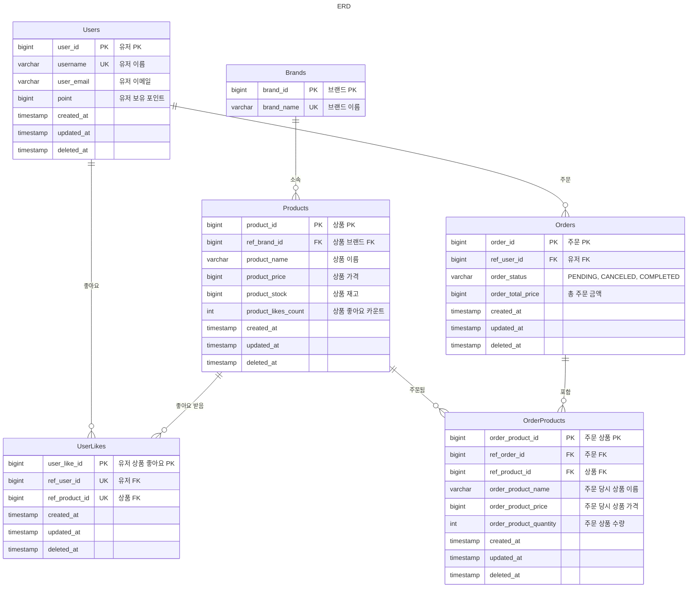

```mermaid
---
title: ERD
---

erDiagram
    Users {
        bigint user_id PK "유저 PK"
        varchar username UK "유저 이름"
        varchar user_email "유저 이메일"
        bigint point "유저 보유 포인트"
        timestamp created_at
        timestamp updated_at
        timestamp deleted_at
    }

    Brands {
        bigint brand_id PK "브랜드 PK"
        varchar brand_name UK "브랜드 이름"
    }

    Products {
        bigint product_id PK "상품 PK"
        bigint ref_brand_id FK "상품 브랜드 FK"
        varchar product_name "상품 이름"
        bigint product_price "상품 가격"
        bigint product_stock "상품 재고"
        int product_likes_count "상품 좋아요 카운트"
        timestamp created_at
        timestamp updated_at
        timestamp deleted_at
    }

    UserLikes {
        bigint user_like_id PK "유저 상품 좋아요 PK"
        bigint ref_user_id UK "유저 FK"
        bigint ref_product_id UK "상품 FK"
        timestamp created_at
        timestamp updated_at
        timestamp deleted_at
    }

    Orders {
        bigint order_id PK "주문 PK"
        bigint ref_user_id FK "유저 FK"
        varchar order_status "PENDING, CANCELED, COMPLETED"
        bigint order_total_price "총 주문 금액"
        timestamp created_at
        timestamp updated_at
        timestamp deleted_at
    }

    OrderProducts {
        bigint order_product_id PK "주문 상품 PK"
        bigint ref_order_id FK "주문 FK"
        bigint ref_product_id FK "상품 FK"
        varchar order_product_name "주문 당시 상품 이름"
        bigint order_product_price "주문 당시 상품 가격"
        int order_product_quantity "주문 상품 수량"
        timestamp created_at
        timestamp updated_at
        timestamp deleted_at
    }

    Users ||--o{ UserLikes: "좋아요"
    Users ||--o{ Orders: "주문"
    Brands ||--o{ Products: "소속"
    Products ||--o{ UserLikes: "좋아요 받음"
    Products ||--o{ OrderProducts: "주문됨"
    Orders ||--o{ OrderProducts: "포함"
```